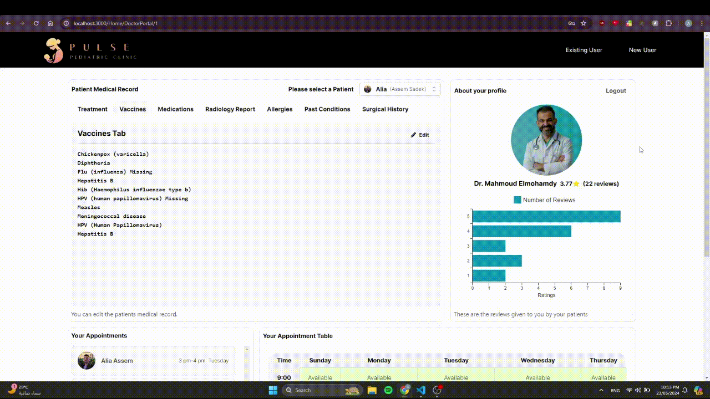
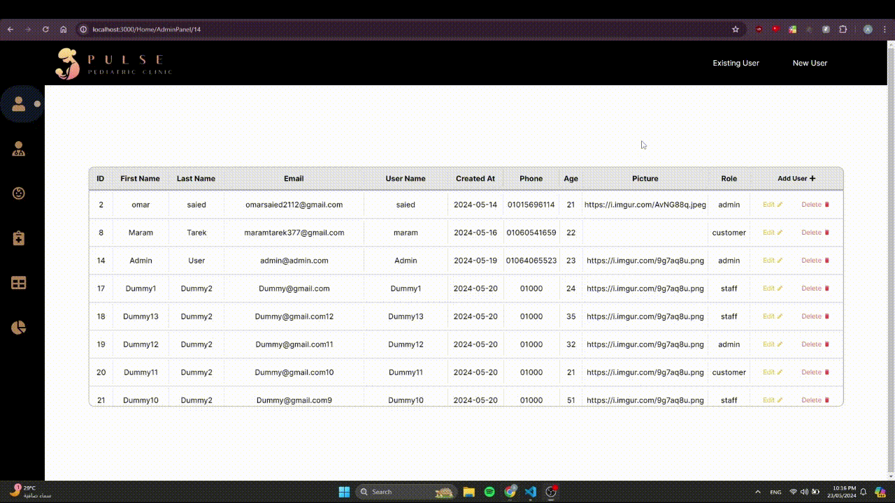

# Pediatric Clinic Management System

## Overview

Welcome to the Pediatric Clinic Management System, a comprehensive solution designed to streamline the operations of a pediatric clinic. This system comprises both a web application and a mobile application, each tailored to meet the needs of patients, doctors, and clinic staff. 

### Web Application

The web application includes the following portals:
- **Patient Portal:** Enables patients and their guardians to book appointments, view medical records, and communicate with healthcare providers.
- **Doctor Portal:** Provides doctors with tools to manage patient information, schedule appointments, and access medical histories.
- **Staff Portal:** Allows clinic staff to handle administrative tasks, manage patient flow, and coordinate between different departments.
- **Admin Panel:** Offers administrative capabilities for managing user roles, monitoring system performance, and configuring clinic settings.

### Mobile Application

The mobile application aims to enhance user experience by providing access to the following portals on the go:
- **Patient Portal:** Similar to the web version, this allows patients and their guardians to manage appointments, view medical records, and communicate with doctors.
- **Doctor Portal:** Enables doctors to access patient information, manage appointments, and stay updated with clinic activities from their mobile devices.

## Features

### Web Application
- Landing Page
  Demo:
    
  
- **Patient Portal:**
  - Appointment scheduling
  - Medical record access
  - Doctor communication
 Demo:
    

- **Doctor Portal:**
  - Patient information management
  - Appointment management
  - Medical history access
Demo:
    

- **Admin Panel:**
  - User role management
  - System performance monitoring
  - Clinic settings configuration
Demo:
    

- **Staff Portal:**
  - Administrative task management
  - Patient flow coordination

### Mobile Application
- **Patient Portal:**
  - Appointment scheduling
  - Medical record access
  - Doctor communication
- **Doctor Portal:**
  - Patient information management
  - Appointment management
  - Medical history access

## Getting Started

### Prerequisites

- Web browser (for web application)
- Android device (for mobile application)
- Internet connection

### Installation

#### Web Application
1. Clone the repository:
    ```bash
    git clone https://github.com/AssemSadek90/pediatric-pulse.git
    ```
2. Navigate to the project directory:
    ```bash
    cd frontend
    ```
3. Install dependencies:
    ```bash
    npm install
    ```
4. Create .env.local file and add to it:
    ```bash
    NEXT_PUBLIC_SERVER_NAME=https://pediatric-pulse.onrender.com
    ```
5. Run the application:
    ```bash
    npm run dev
    ```
6. Open your web browser and go to:
    ```
    http://localhost:3000
    ```

#### Mobile Application
- Download the APK file from the link below:
  [Download APK](https://drive.google.com/uc?export=download&id=1SytD4rQxmdjy4ixm1Odtz4UqUjFXSlVc)
  
- Install the APK on your Android device.

## API Documentation

For detailed API documentation, please refer to our API documentation:
[API Documentation](https://pediatric-pulse.onrender.com)


## Contact

If you have any questions or need further assistance, feel free to reach out:

- Email: omarsaied2112@gmail.com && abdelhamid.ssen@gmail.com
- Issues: [GitHub Issues](https://github.com/3marsaied/pediatric-pulse)
